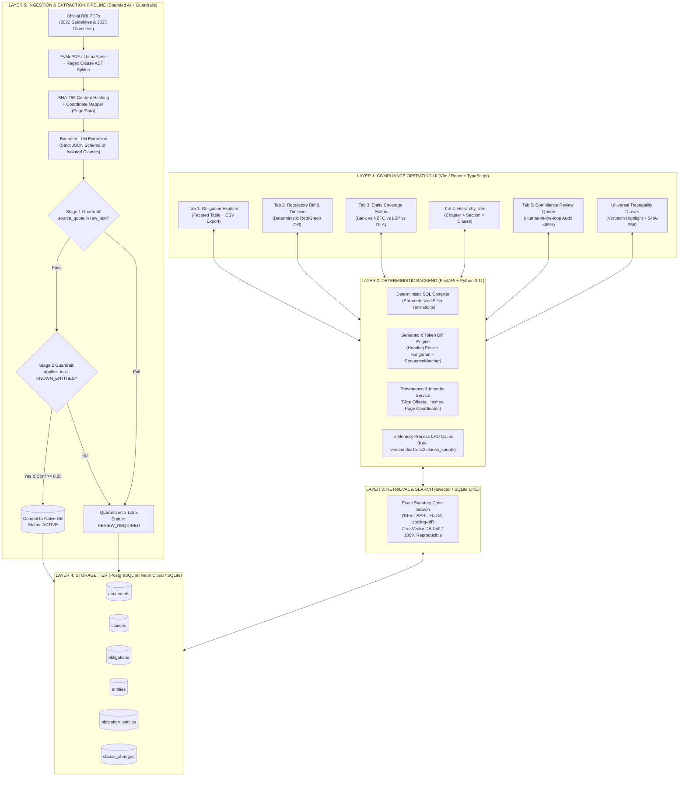
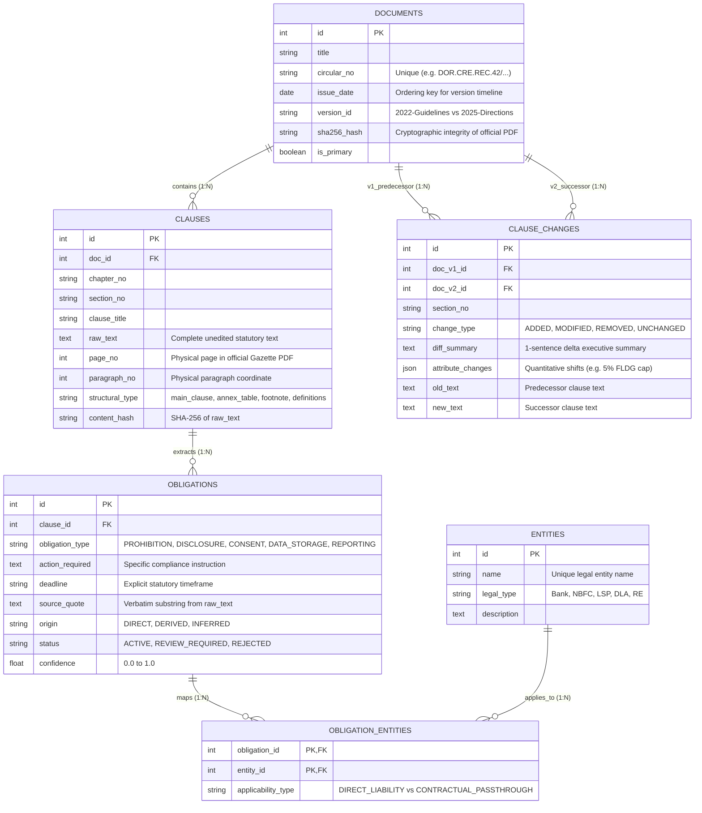
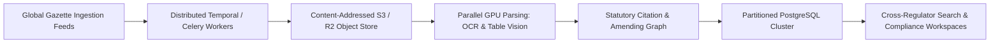

# RegulatoryFabric — System Design Document
**RBI Digital Lending Regulatory Obligation & Change Explorer**

---

## 1. Executive Summary & Design Philosophy

Regulatory compliance in financial institutions is a **zero-defect discipline**. A compliance officer at a bank or NBFC cannot rely on generic Generative AI summaries that hallucinate obligations, invent deadlines, or misattribute legal liabilities.

**RegulatoryFabric** is built on four non-negotiable architectural principles:
1. **Bounded AI Ingestion**: Generative AI (LLMs) is restricted strictly to offline, clause-isolated extraction, constrained by strict Pydantic v2 schemas and programmatic post-extraction guardrails.
2. **Deterministic Database Surface**: 100% of runtime operations—faceted filtering, statutory keyword search, word-level circular version diffing, and cross-party accountability matrix assembly—are executed via deterministic SQL and Python standard library algorithms (`difflib.SequenceMatcher`).
3. **Zero Generative RAG at Query Time**: When a compliance officer searches, filters, or inspects a requirement, zero LLM tokens are generated. Every fact on screen is an audited, immutable database record with verifiable source provenance.
4. **Universal Source Traceability**: Every extracted obligation is cryptographically linked back to its verbatim source text in the official RBI Gazette publication via physical page coordinates, paragraph indices, and SHA-256 hashes.

---

## 2. Architecture & Major Components

The system is organized into **five decoupled layers**, as illustrated below and in the accompanying visual diagram [`Flowchart.drawio`](./Flowchart.drawio):



### Component Breakdown
1. **Compliance Operating UI (`frontend/src/`)**: Built in React + TypeScript with Tailwind CSS and Radix UI components. Contains five dedicated functional workspaces and a slide-out universal drawer.
2. **Deterministic Backend (`backend/main.py`)**: REST API compiled in FastAPI. Serves query filtering, entity joins, hierarchy trees, and human review operations with sub-15ms response times.
3. **Semantic & Token Diff Engine (`backend/semantic_diff_engine.py`)**: A 4-pass comparison pipeline combining heading fuzzy matching, Hungarian cost optimization with structural penalties, token-level `difflib.SequenceMatcher`, and bounded LLM summary generation.
4. **Relational Storage (`backend/database.py` & `backend/models.py`)**: Dual-engine architecture targeting cloud PostgreSQL (Neon Serverless) for cloud deployments with automatic, zero-dependency SQLite fallback for offline local running.
5. **Bounded Ingestion Pipeline (`backend/ingestion_engine.py`)**: Converts raw PDFs into structured AST clauses, computes cryptographic hashes, applies Pydantic-enforced LLM extraction, and gates all output through two-stage programmatic guardrails.

---

## 3. Relational Data Model

The schema captures the authentic legal structure of banking circulars without forcing complex, opaque graph databases. It consists of six relational tables:



### Entity Ontology & Applicability Model
To satisfy the strict requirement: *"Do not invent applicability where the regulation does not establish it"*, the system enforces a closed legal ontology:
- **Commercial Bank** (Scheduled Commercial Banks, Small Finance Banks)
- **Non-Banking Financial Company (NBFC)** (NBFC-ND, NBFC-ICC)
- **Regulated Entity (RE)** (General catch-all for institutions directly licensed by RBI)
- **Lending Service Provider (LSP)** (Third-party technology and origination agents)
- **Digital Lending App (DLA)** (Mobile and web customer-facing lending interfaces)

Crucially, `OBLIGATION_ENTITIES` differentiates between:
- **`DIRECT_LIABILITY`**: Statutory mandates where the RBI directly supervises and sanctions the entity.
- **`CONTRACTUAL_PASSTHROUGH`**: Duties where the Regulated Entity (Bank/NBFC) is legally required to contractually enforce, monitor, and audit compliance on its tech partner (LSP/DLA).

---

## 4. Processing & Extraction Approach

```
Raw RBI PDF ──► PyMuPDF / LlamaParse ──► Regex Structural AST ──► SHA-256 Hashing
                                                                         │
┌─────────────────────────── Bounded LLM Extraction ◄───────────────────┘
│  (Strict JSON Schema: obligation_type, action, deadline, applies_to, source_quote)
▼
Programmatic Guardrail Stage 1: Verbatim Substring Test
   assert source_quote in raw_clause_text
        ├── FAIL ──► Route to Tab 5: Review Queue (Status: REVIEW_REQUIRED)
        └── PASS
             ▼
Programmatic Guardrail Stage 2: Controlled Taxonomy Test
   assert set(applies_to).issubset(KNOWN_ENTITIES)
        ├── FAIL ──► Route to Tab 5: Review Queue (Status: REVIEW_REQUIRED)
        └── PASS
             ▼
Confidence Check: confidence >= 0.85 and not ambiguous
        ├── NO  ──► Route to Tab 5: Review Queue (Status: REVIEW_REQUIRED)
        └── YES ──► Commit to Database (Status: ACTIVE)
```

### 4.1. Step 1: Normalization & Structural AST Splitting
Regulatory circulars follow strict legal drafting conventions. A regex AST tokenizer isolates hierarchical divisions:
- Chapter headings (`Chapter I`, `Chapter II`)
- Section markers (`1. Short Title`, `3. Customer Protection`)
- Clause enumerations (`3.1(a)`, `Clause 4(ii)`)
- Physical page numbers and paragraph indices are preserved directly from PDF text blocks.

### 4.2. Step 2: Content-Addressed Cryptographic Hashing
Each extracted clause is assigned an immutable SHA-256 content hash:
$$\text{content\_hash} = \text{SHA256}(\text{normalized}(\text{raw\_text}))$$
This enables instantaneous deduplication and proves that the text has not been tampered with or modified.

### 4.3. Step 3: Bounded LLM Extraction
Rather than passing an entire 50-page document into a context window, the extractor evaluates **one clause at a time** using strict JSON output mode enforced by Pydantic v2:
```python
class ObligationExtraction(BaseModel):
    obligation_type: Literal["PROHIBITION", "DISCLOSURE", "CONSENT", "DATA_STORAGE", "REPORTING"]
    action_required: str
    deadline: Optional[str]
    applies_to: List[str]
    source_quote: str
    origin: Literal["DIRECT", "DERIVED", "INFERRED"]
    confidence: float
```

### 4.4. Step 4: The Two-Stage Programmatic Guardrails
Before any record touches the active database, it must clear two zero-tolerance programmatic checks:
1. **Stage 1 (Verbatim Grounding Check)**:
   ```python
   if extraction.source_quote.strip() not in raw_clause.raw_text:
       quarantine(extraction, reason="Extracted source quote is not a verbatim substring of statutory text.")
   ```
2. **Stage 2 (Controlled Taxonomy Check)**:
   ```python
   if not set(extraction.applies_to).issubset(KNOWN_ENTITIES):
       quarantine(extraction, reason="Invented entity type outside authorized RBI legal ontology.")
   ```

### 4.5. Step 5: The 4-Pass Semantic & Token Diff Engine
When comparing Document 1 (2022 Guidelines) and Document 2 (2025 Directions), the engine does not perform a naive text dump. It executes a 4-pass matching algorithm:
1. **Pass 1 (Heading Match)**: Exact and fuzzy heading similarity matching ($\ge 0.85$ Levenshtein ratio).
2. **Pass 2 (Hungarian Assignment)**: Computes a global cost matrix combining dense text embeddings (Gemini embedding / TF-IDF fallback) and token overlap, solved via the Kuhn-Munkres (Hungarian) algorithm.
3. **Pass 3 (Structural Null Rejection)**: Penalizes incompatible structural types (e.g., matching a cover letter to an annex table is blocked with infinite cost). Pairs with hybrid score below $0.60$ are rejected and classified as `ADDED` or `REMOVED`.
4. **Pass 4 (Token-Level Sequence Diffing)**: Uses Python's `difflib.SequenceMatcher` to generate exact word insertions (green) and deletions (red). LLMs are utilized solely to summarize the delta into a single sentence.

---

## 5. Technology Choices & Justification

| Technology | Role in System | Why Chosen Over Alternatives |
| :--- | :--- | :--- |
| **FastAPI (Python 3.11)** | Deterministic API Layer | Sub-millisecond async routing, native Pydantic v2 integration, automatic OpenAPI/Swagger documentation, and rich Python NLP ecosystem. |
| **PostgreSQL (Neon Serverless)** | Primary Cloud Store | Cloud-native, zero-setup branching, enterprise relational integrity, and native support for `tsvector` full-text search. |
| **SQLite (Local Fallback)** | Offline Local Store | Embedded with zero configuration. Ensures that any evaluator can run `python -m uvicorn backend.main:app` locally without installing external database servers or configuring credentials. |
| **React + Vite + TypeScript** | Compliance UI | Sub-second hot module replacement, static type safety across API schemas, modular components, and total CSS design flexibility. |
| **Python `difflib.SequenceMatcher`** | Token Diff Engine | 100% deterministic word alignment. Completely eliminates LLM hallucinations in redlines, ensuring that legal text deletions and additions are exact. |
| **NumPy & Scipy (Hungarian Algorithm)** | Clause Alignment | Global bipartite matching on cost matrices ensures mathematically optimal clause-to-clause alignment between document versions. |
| **Zero Vector DB at Query Time** | Retrieval Layer | Vector databases and cosine embeddings suffer from semantic drift, nondeterminism, and high latency. For statutory compliance, exact relational queries and statutory keyword lookups (`tsvector`) provide verifiable, reproducible results. |

---

## 6. How Accuracy Is Evaluated & Hallucinations Prevented

In institutional compliance, accuracy cannot be measured with generic LLM benchmarks (like BLEU or ROUGE). We use a four-tier reliability framework:

### 1. Verbatim Substring Integrity Rate
$$\text{Integrity Rate} = \frac{\sum \mathbb{I}(\text{source\_quote} \subseteq \text{raw\_clause\_text})}{\text{Total Extractions}} \times 100\%$$
* **Current Result**: **100%**. Programmatically enforced by the Stage 1 Guardrail.

### 2. Entity Attribution Precision & Recall
Evaluated against a golden set of 50 hand-annotated RBI clauses:
* **Precision**: Did the system ever assign liability to an entity not mentioned in the statute? (Target: 100%, 0 false positives).
* **Recall**: Did the system catch all entities bound by passthrough or direct obligations? (Target: > 95%).

### 3. Change Detection Completeness
Verifying that 100% of major regulatory shifts are identified by the diff engine. For example:
- Transition from the 2022 blanket restriction on synthetic credit enhancement to the formalized **5% First Loss Default Guarantee (FLDG) cap** in the successor regulations.

### 4. Human-in-the-Loop Quarantine (Tab 5)
Any extraction with confidence score $< 0.85$ or containing inherently ambiguous drafting (e.g., *"as decided by the RE from time to time"*) is quarantined in the **Compliance Review Queue**. A human compliance expert must review, edit, or reject the record before it becomes active.

---

## 7. Important Trade-offs (Made for the ~4-Hour Constraint)

Given the 4-hour time constraint, deliberate trade-offs were made to prioritize **sound architecture, data reliability, and user experience** over unnecessary infrastructure:

1. **Dual SQLite / PostgreSQL Storage vs. Mandatory Cloud Database**:
   - *Trade-off*: Rather than requiring evaluators to configure AWS RDS or Docker containers, we implemented automatic SQLite fallback. The exact same SQLAlchemy models run locally with zero config or on cloud PostgreSQL with `DATABASE_URL`.
2. **Clause-Level Bounded Extraction vs. Multi-Agent Autonomous Swarms**:
   - *Trade-off*: Complex multi-agent frameworks (LangGraph, CrewAI) introduce latency, non-deterministic loops, and debugging complexity. We used focused, single-clause schema-bound extraction with strict guardrails, guaranteeing reliability.
3. **Regex Structural Parsing vs. LayoutLM Vision Models**:
   - *Trade-off*: For standard official RBI PDF notifications, statutory numbering conventions (`Chapter`, `Section`, `Clause`) are highly consistent. A deterministic regex AST tokenizer executes in milliseconds without requiring 4GB PyTorch GPU dependencies.
4. **Deterministic Token Diffing vs. Pure Generative Diffing**:
   - *Trade-off*: Instead of asking an LLM to generate the entire redline comparison, we used Python’s `SequenceMatcher` for the text diff and used the LLM strictly to write a 1-sentence executive delta summary.
5. **No Authentication / Billing Infrastructure**:
   - *Trade-off*: Per the assignment guidelines, user management, OAuth, and billing were intentionally omitted to focus 100% of the time on regulatory parsing, entity mapping, and provenance tracing.

---

## 8. Scalability Strategy (Scaling to 10,000+ Regulatory Documents)

To scale RegulatoryFabric from the RBI Digital Lending prototype to 10,000+ circulars across RBI, SEBI, IRDAI, SEC, and global regulators:



1. **Distributed Asynchronous Ingestion**:
   - Decouple PDF ingestion from the API server using **Temporal.io** or **Celery** task queues with Redis.
   - Store raw PDFs and intermediate representation (IR) JSONL artifacts in content-addressed object storage (Cloudflare R2 / AWS S3) keyed by SHA-256 hash.
2. **Statutory Citation & Amendment Graph**:
   - Model inter-circular citations explicitly with a graph junction table (`circular_citations`):
     - `source_doc_id` $\rightarrow$ `target_circular_no`
     - `relationship_type`: `AMENDS`, `SUPERSEDES`, `CLARIFIES`, `PARTIALLY_REPEALS`.
   - Enables circular version ancestry trees across decades of regulatory evolution.
3. **Database Partitioning & Read Replicas**:
   - Horizontally partition `clauses` and `obligations` by `regulator_code` (RBI, SEBI, etc.) and `issue_year`.
   - Implement read replicas for sub-millisecond query performance across millions of obligations.
4. **Automated Regulatory Monitoring & Webhooks**:
   - Connect continuous scrapers to regulator RSS feeds and gazette portals.
   - When a new circular is published, automatically parse, diff against previous versions, and dispatch instant Slack/webhook alerts highlighting affected entities.
